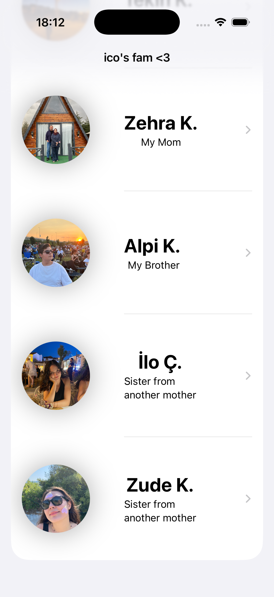
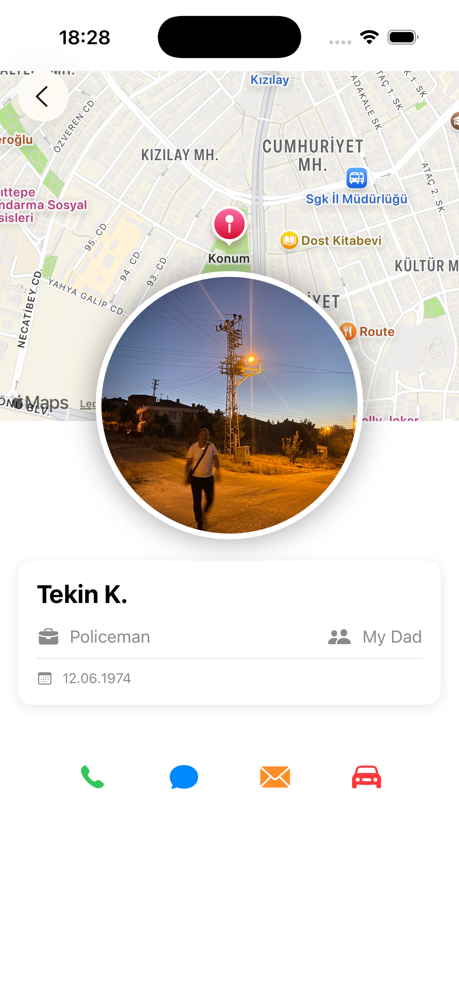
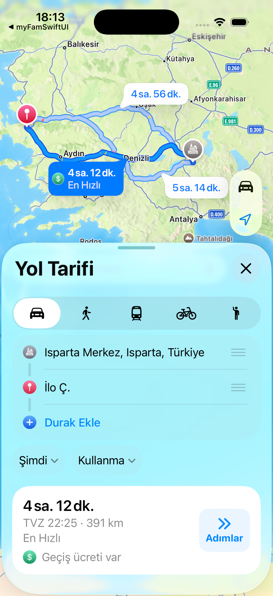

## Ekran Görüntüleri

Uygulamanın nasıl göründüğüne dair birkaç kare:

<table>
    <tr>
    <td></td>
    <td></td>
  </tr>
  <tr>
    <td></td>
    <td></td>
  </tr>
<tr>
    <td></td>
  </tr>
</table>
